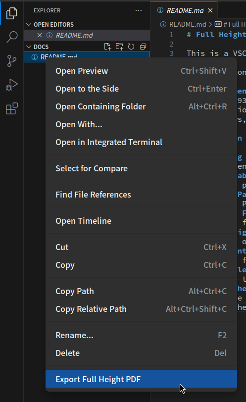
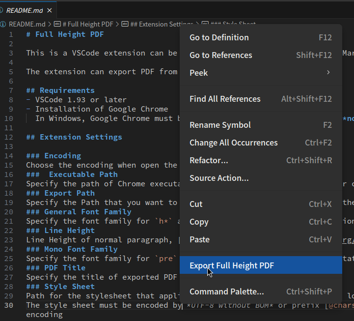

# Full Height PDF

This is a VSCode extension can be use to create Full Height PDF from Markdown.   

The extension can export PDF from context menu of editor or explorer.  

## Requirements
- VSCode 1.93 or later
- Installation of Google Chrome   
  In Windows, Google Chrome must be installed on C:\Program Files, (**not C:\Program Files(x86)**) or you must set *Executable Path* by yourself.  

## Extension Settings

### Encoding
Choose the encoding when open the file from vscode explorer context.
###  Executable Path
Specify the path of Chrome executable to let the extension use another chrome installation.  
### General Font Family
Specify the font family for `h*` and `td` tag. (CSS Font family notation)
### Line Height
Line Height of normal paragraph, [length](https://developer.mozilla.org/ja/docs/Web/CSS/length) can be use to specify. 
### Mono Font Family
Specify the font family for `pre` and `code` tag. (CSS Font family Notation)
### PDF Title
Specify the title of exported PDF
### Style Sheet
Path for the stylesheet that applied to exported PDF (This option has lower priority than each options in Setting),
The style sheet must be encoded by *UTF-8 without BOM* or prefix [@charset](https://developer.mozilla.org/ja/docs/Web/CSS/@charset) with correct encoding.

## Screen shots

